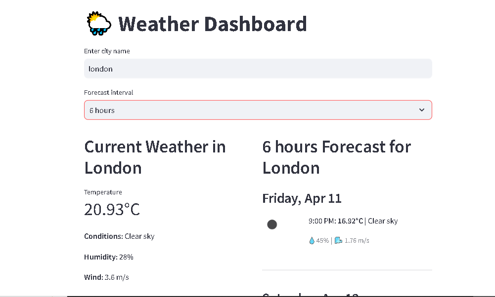

# Weather Dashboard

A simple Python project that shows current weather and 5-day forecasts using the OpenWeatherMap API.  
You can use it either through the **command-line** or a **Streamlit web app**.

---
## 📸 Screenshot




## How to Set Up

 **Clone the project:**

```bash
git clone https://github.com/yourusername/weather-app.git
cd weather-app
